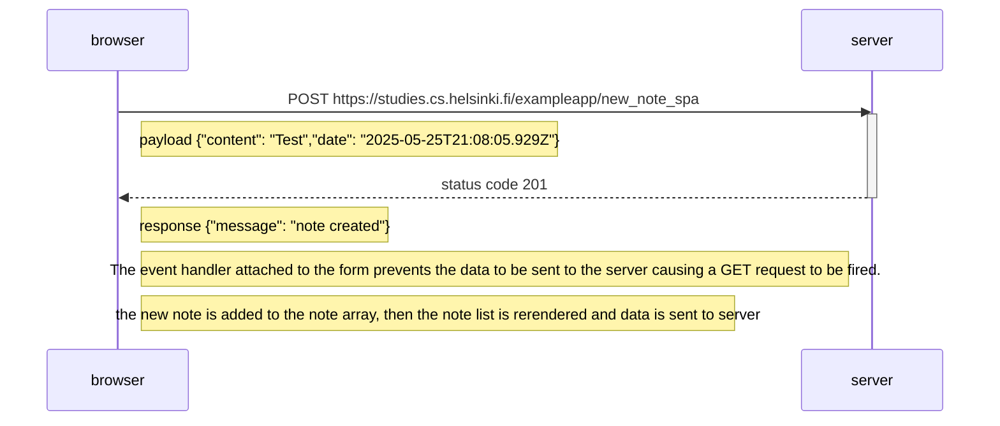

```mermaid
sequenceDiagram
    participant browser
    participant server

    browser->>server: POST https://studies.cs.helsinki.fi/exampleapp/new_note_spa
    activate server

    Note right of browser: payload {"content": "Test","date": "2025-05-25T21:08:05.929Z"}
    server-->>browser: status code 201
    deactivate server

    Note right of browser: response {"message": "note created"}

    Note right of browser: The event handler attached to the form prevents the data to be sent to the server causing a GET request to be fired.
    Note right of browser: the new note is added to the note array, then the note list is rerendered and data is sent to server

```
